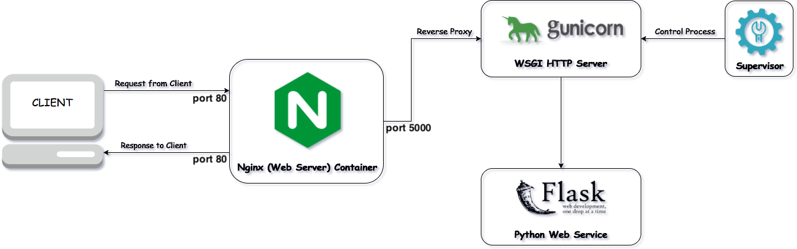
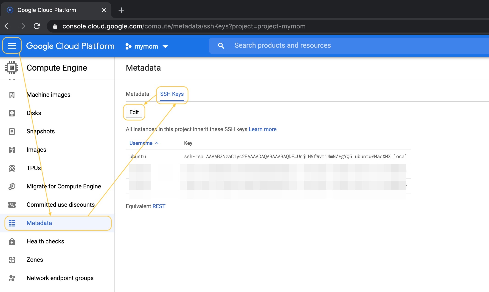
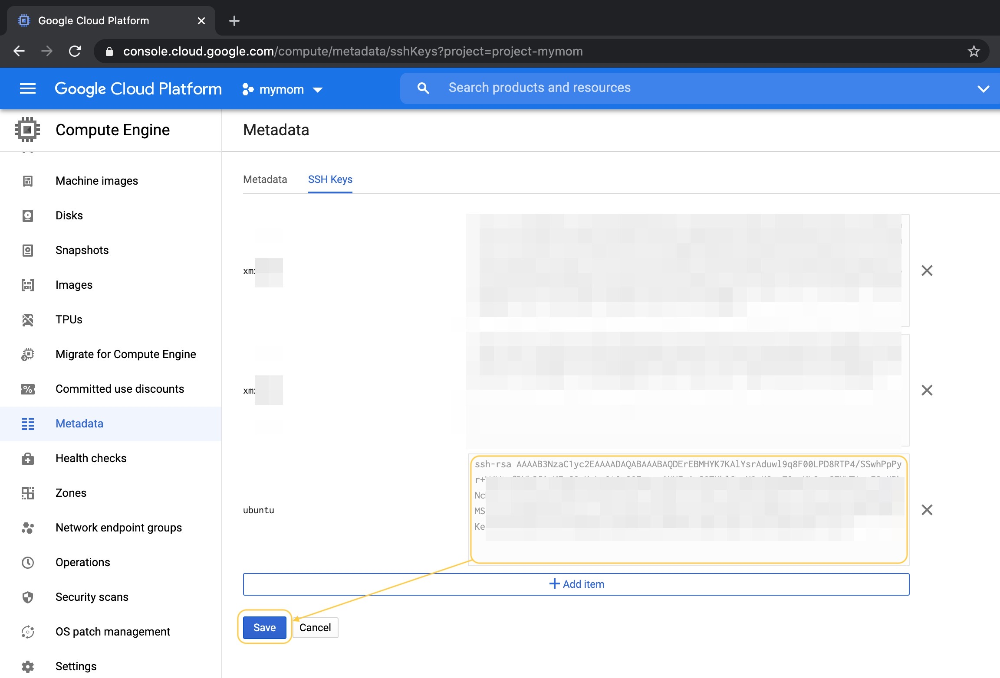

# PsychoExp



## 시스템 접속

시스템에서 유저의 종류가 3가지 있습니다.

- `root`

- `ubuntu` GCP에서 기본적으로 존재한 유저이며 **본 프로젝트의 관리자**로 사용되고 있습니다.

- `[other]` GCP에서 프로젝트에 공동작업자를 추가하면 자동 생성되는 개인 계정들입니다.

**따라서 본 프로젝트를 유지보수하는 동안 개발자는 항상 개인 계정 대신 `ubuntu`로 접속해야 합니다.**

안전성을 고려해 SSH암호키 접속만 허용하고 있으며 아래와 같이 `ubuntu`의 키를 개발자의 SSH Public Key로 설정하면 개발자가 편하게 시스템에 접속 할 수 있습니다.





이제 개발자는 아래와 같이 로그인할 수 있습니다.

```bash
$ ssh ubuntu@flourish.kr -p 1307 # 1307는 서버의 SSH 포트임
```

## 개발 환경

Miniconda로 Python의 가상환경과 패키지를 관리하고 있으며 본 프로젝트의 가상환경의 이름은 `cienv`입니다.

```bash
$ conda activate cienv # 가상환경에 들어감
$ conda deactivate # 가상환경에서 나옴
$ conda list # 현재 환경에 설치되어있는 패키지 목록확인
```

Supervisor는 프로세스를 관리하는 톨입니다.

```bash
$ supervisorctl status # 현재 관리 중인 프로세스들의 실행 상태 확인
$ supervisorctl reload # Supervisor 재시작
$ supervisorctl stop all # 현재 관리 중인 프로세스들 모두 정지
$ supervisorctl shutdown # Supervisor 종료
```

(주의: 이는 conda로도 깔 수 있으나 시스템 서비스를 관리하는 도구이기 때문에 여기서는 `apt install`로 깔았습니다.)

서버에서 이미 Supervisor를 자동실행으로 설정되어 있으며 Psyx서비스도 Supervisor의 시작과 같이 실행되게 설정했습니다.

## 프로젝트 관리

본 프로젝트는 아래 2개의 폴더로 이루어집니다.

```txt
~/Psyx					# 코드 (Git로 관리되는 부분)
├── README.md
├── config/
├── html/
└── service/

~/PsyxStatic			# 데이터 : 웹 관리자 계정, 실험 세트, 실행 로그
├── psyx.htpasswd
├── packs/
└── logs
    ├── api
    ├── api.20201009.log
    ├── api.20201008.log
    ├── api.20201007.log
    ├── psyx_supervisord_stderr.log
    └── psyx_supervisord_stdout.log
```

이 중 `Psyx/`는 README.md 참고하면 되며 `PsyxStatic/`에 대해서 간단하게 설명하겠습니다.

- `psyx.htpasswd` 웹 관리자의 계정을 기록하는 파일입니다.
- `packs/` 실험 세트마다 하나의 폴더로 사진들이 관리됩니다.
- `logs/` 서비스 운영하는 동안 발생한 API 호출 상황과 프로세스 자체의 실행 상황 두 가지의 로그가 존재합니다.

## 웹 관리자

관리자 로그인은 Nginx HTTP Basic Authentication과 을 이용해 구현하였습니다.

아이디와 비번을 저장하는 파일은 `psyx.htpasswd`이며 이는 Nginx의 설정 파일 `/etc/nginx/conf.d/ci.conf`에서 아래와 같이 지정한 것 입니다.

```txt
location /admin {
    ...
    auth_basic_user_file /home/ubuntu/PsyxStatic/psyx.htpasswd;
    ...
}
```

아래 명령으로 `psyx.htpasswd`파일을 새로 생성하면 관리자 계정을 바꿀 수 있습니다.

```bash
$ htpasswd -c /home/ubuntu/.htpasswd [username] # 기존 파일이 지워지며 username으로 새 계정이 생성됨
```

## 로그

### API로그

- Python의 logging모듈로 찍음
- 날짜 없는 `api.log`는 당일 생성된 새 로그 파일이며 다음 날이 되면 이름에 날짜가 붙이게 됨
- 모든 로그가 14일 지나면 자동으로 삭제됨

### 프로세스 로그

- Supervisor가 프로세스를 관리하면서 찍음
- 날짜와 상관없이 최대 크기를 넘으면 새 파일을 생성해서 기록함
- 최대 14 개의 로그 파일을 보관함

## API

### Response

기본적으로 아래 3가지의 응답만 합니다.

- `200` 정상적으로 처리됨 >> JSON/TEXT 반환 (JSON for Data, TEXT for Alert Message)
- `400` 사용자 입력에 문제가 있으나 요청 자체는 정상적으로 처리됨 >> HTML 반환
- `500` 서버에 문제가 존재하여 요청을 처리할 수가 없음 >> HTML 반환

즉, `200`과 `400`은 둘 다 정상적인 응답이며 `500`이나 다른 응답이 발생한 경우는 코드나 서버에 문제가 존재한다는 뜻이며 즉시 점검해야 합니다.

### 관리자 API

```txt
GET /api/admin/list # 기존 세트 정보 불러오기
```

- Parameter: 없음

```txt
POST /api/admin/create # 새 세트 추가
```

- Parameter: 없음
- Body: Form(세트 정보 + 사진 파일들)

```txt
GET /api/admin/remove?id # 기존 세트 삭제
```

- Parameter: 세트 아이디 (즉, p_id)

```txt
GET /api/admin/download?id # 세트의 응답들을 JSON형식으로 다운로드
```

- Parameter: 세트 아이디 (즉, p_id)

### 사용자 API

```txt
POST /api/reply/start # 응답할 수 있는 세트 찾기
```

- Parameter: 없음
- Body: JSON

```txt
POST /api/reply/submit # 응답 제출
```

- Parameter: 없음
- Body: JSON

## API로 세트의 응답 불러오기

다운로드 API를 사용하면 세트 자신의 정보와 응답들을 한 번에 불러올 수 있습니다.

(URL에 들어가는 매개변수 `id`는 세트의 `p_id`이며 관리자 페이지에서 나온 `ID`입니다)

```python
import requests

response = requests.get("http://flourish.kr/api/admin/download?id=1")
if response.status_code == requests.codes.ok:
    pack = response.json() # 세트 dict
    replies = pack['replies'] # 응답 list
    for reply in replies:
        print(reply['name'], reply['age'], reply['date']) # 성명/나이/응답날짜 출력
else:
    print('Request Failed:', response.status_code)
```

위의 코드가 한 세트의 모든 응답자의 성명/나이/응답날짜를 아래와 같이 출력합니다.

```txt
홍길동 25 2020-10-08 16:04:08
김상현 23 2020-10-08 16:12:01
이성호 28 2020-10-08 16:13:32
박민수 24 2020-10-08 16:36:08
```